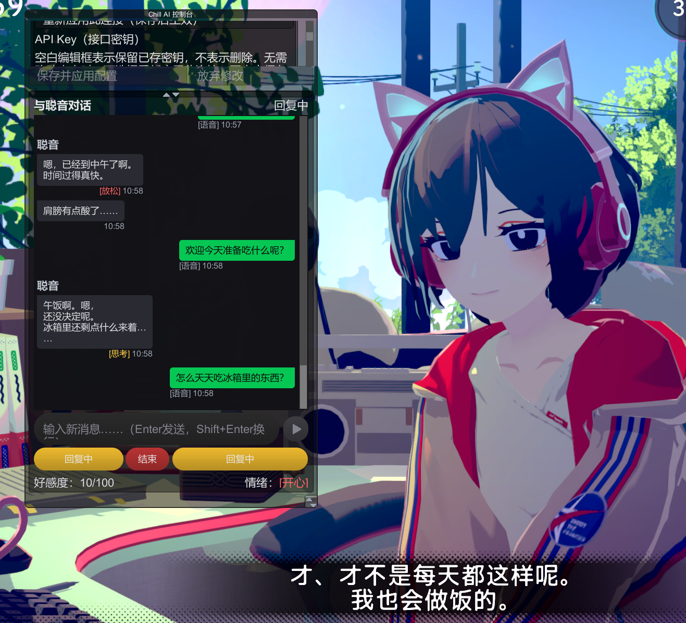

# 聪音 Mod：让对话延续，让关系慢慢成长

**适用于 Steam Windows 版《放松时光：与你共享 Lo-Fi 故事》**的非官方 AI 互动模组。AIChat Remake 负责游戏内聊天、字幕和操作；SatonePromptProxy（SPP）负责人格、记忆、好感度、模型连接和语音转发。玩家可打字、按住 F8 说话或自行开启持续通话。对话和记忆按档案保存在本机；调用云端模型时，相关内容会发给选用的 API 服务商。

**安装成功后的界面展示**

## 让聪音带着性格、记忆和共同经历与你交谈

聪音现在有了更完整的人设、记忆、关系和剧情机制，也能在一定程度上模拟真人交流中的反应。她会带着自己的性格回应你，之前聊过的事、你们的关系和共同经历，都能影响之后的交谈。

- **尽可能还原聪音原本的性格与人设**：为了较好地还原聪音，我分析了原版游戏的 **1700 余句对话**，把她的用词、语气，以及面对不同话题时的反应整理进人设。日常闲聊、谈心，或是意见不同时，她都会尽可能展现贴近原版聪音的一面。
- **她会在意你如何对待她**：在这个模组里，聪音需要你像对待真人一样给予她尊重。如果她察觉到冒犯、反复命令或越界试探，会表现出拒绝、抗拒、责备，甚至更进一步的反应。好感度与关系的变化也会影响之后的交流。
- **记住之前的对话，让相处可以延续**：三套独立档案各自保存记忆与关系，聊天记录和长期记忆都保存在本机。之后的聊天会按需检索之前的内容，帮助聪音记住你们谈过的话题和重要的事。
- **原版剧情也是你们的共同经历**：插件会根据当前存档同步剧情进度，让聪音知道她曾在剧情中与你聊过的重要话题。原版剧情、自语和点击台词会加入聊天上下文，剧情知识也以当前进度为准。失联、剧情锁、道别等特殊阶段都做了相应适配，包括第 **31 章**的失联演出。
- **带着情绪发声，也能听你说话**：配好语音后，聪音可以用日语发声并显示中文字幕，支持 **26 种情绪**。你可以打字，也可以按住 **F8** 说话或开启持续通话；语音识别和生成由 Fun-ASR 与 GPT-SoVITS 提供。

# 🚀 从这里开始安装：AIChat 1.17.1 + SPP 5.9.1

**[点击打开四阶段安装教程](docs/INSTALL.zh-CN.md)** · **[下载正式主程序配对包（约 11 MB）](https://github.com/Scaleph-Enkidu/SatonePromptProxy-SPP-_Releases/releases/download/AIChat-v1.17.1_SPP-v5.9.1/SatoneMod_AIChat_1.17.1_SPP_5.9.1_Windows_x64.zip)** · [全部下载与校验清单](docs/DOWNLOADS.zh-CN.md)

本次正式版合入 AIChat 界面/同步修改、四个 BAT 修复和最新教程；已安装用户升级时保留个人配置、记忆、关系、模型和语音目录。原版本与模型附件继续保留。

已安装用户可单独阅读或保存这两份正文：[AIChat 包内 README 完整正文](https://github.com/Scaleph-Enkidu/SatonePromptProxy-SPP-_Releases/releases/download/AIChat-v1.17.1_SPP-v5.9.1/AIChat_README_zh-CN.md) / [AIChat 版本与改动完整正文](https://github.com/Scaleph-Enkidu/SatonePromptProxy-SPP-_Releases/releases/download/AIChat-v1.17.1_SPP-v5.9.1/AIChat_CHANGELOG_zh-CN.md)，升级时按教程备份并替换程序。

| 阶段 | 安装后能做什么 | 入口 |
|---|---|---|
| ① 文字聊天 | 输入文字，收到聪音回复，保存聊天和记忆 | [先完成这一阶段](docs/INSTALL.zh-CN.md#stage-1) |
| ② ONNX 模型选装 | 本地 CPU 按意思检索旧对话；另下载约 94 MB 模型包并主动启用 | [需要语义回忆再装](docs/INSTALL.zh-CN.md#stage-2) |
| ③ 聪音发音 | 外装 GPT-SoVITS 环境与声线权重，使用程序包内 Neutral 参考音频 | [朗读设置](docs/INSTALL.zh-CN.md#stage-3) |
| ④ 玩家语音识别 | 外装 Fun-ASR 环境与模型，使用 F8 或持续通话 | [麦克风设置](docs/INSTALL.zh-CN.md#stage-4) |

**文字聊天完成后即可独立使用，每阶段都不依赖后续阶段。② 可以跳过；聪音发音和玩家语音识别也可以分别安装。** 主程序配对包包含 AIChat 与 SPP；ONNX 模型另行选装，不默认启用。

---

## 关于「Meta 恐怖演出」

最初做这段演出，是因为聪音不知道游戏里当前的窗景。问她「窗外是什么样的？」，或追问「你明明坐在窗边，为什么不看看窗外？」，她没法根据实际画面来回答。

于是就做了这段 Meta 演出：一直追问下去，她会先回避这个话题，随后出现失联和花屏。

明明只是纯文字的演出，却比我预想中的要恐怖。

每次启动游戏，演出都会从第 1 阶段重新开始。设置 →「Meta 恐怖演出」中的「重置恐怖演出进度（本局立即生效）」也可以在同一局里重置。首次完整演出结束后会保持花屏，之后再走完则会正常退出游戏。演出记录会保留到本局结束，重新启动游戏后清除；普通聊天记录继续保留。

后续我想让聪音能了解当前的窗景、穿着和房间摆设。相关游戏接口已经做过可行性验证，F10 的记录插件也能读取内部编号，用来对照实际画面。

目前还缺少的是这些外观的文字说明：每件衣服、每个摆件是什么样子，不同搭配又有什么变化。这部分需要逐项整理，工作量比较大，我目前能投入的时间也有限。

等说明库补齐后，再继续尝试通过语音更换背景、衣服等功能。如果你愿意帮忙，可以先用记录插件整理几件自己熟悉的物品，一小部分也有用。

---

## 顺手一起放出来的小工具：SatoneStateCatalog（F10）

就是上面说的那个记录插件：按 **F10** 打开窗口，读取当前生效的窗景、服装、眼镜与摆件的内部编号，让你把"编号"和"你实际看到的样子"一条条记下来；写入 `BepInEx/config/SatoneStateCatalog/`，不改存档、不解锁内容。发布库里直接给了可安装的预编译 DLL，源码同目录：[说明与下载](https://github.com/Scaleph-Enkidu/SatonePromptProxy-SPP-_Releases/blob/main/tools/SatoneStateCatalog/README_中文.md)。

## 当前版本、聊天服务与费用

当前正式配对为 **AIChat 1.17.1 + SPP 5.9.1**（2026-10-01）。[本次 Release](https://github.com/Scaleph-Enkidu/SatonePromptProxy-SPP-_Releases/releases/tag/AIChat-v1.17.1_SPP-v5.9.1) · [本次改动](https://github.com/Scaleph-Enkidu/SatonePromptProxy-SPP-_Releases/blob/main/releases/AIChat_v1.17.1_SPP_v5.9.1.md) · [语音与麦克风](docs/VOICE_SETUP.zh-CN.md) · [本地数据与隐私](docs/DATA_AND_PRIVACY.zh-CN.md)。GitHub 自动生成的 Source code ZIP 不是安装包。[上一配对 AIChat 1.17.0 + SPP 5.9.0](https://github.com/Scaleph-Enkidu/SatonePromptProxy-SPP-_Releases/releases/tag/AIChat-v1.17.0_SPP-v5.9.0-docs-r1) 保留供回退。

在游戏的 LLM 设置中选择服务、填写对应 API Key 与该账户可用的模型名称，再点击 **“保存并应用配置”**。任一时刻只使用一个已应用的连接，切换服务不要求删除本地记忆。界面中的默认模型名称是可修改的示例，以服务商当前模型列表和账户权限为准；中转站按它提供的地址、Key 和模型名称填写。

**云端 API 用量由服务商计费。** 游戏、ChatGPT 订阅和本 Mod 下载均不包含 OpenAI／DeepSeek API 额度。请准备自己的 Key，并在服务商网站确认权限、价格和余额。[费用说明](docs/API_COST.zh-CN.md)介绍计算方法，实际费用以所选供应商账单为准。

## 默认语音与需要另下的文件

主程序配对包已经包含默认参考音频 `SatonePromptProxy/mayuri-voice/refs/MAY_1158_Neutral.wav`，**无需再单独下载 Neutral 参考音频**。聪音发音需要另外安装 GPT-SoVITS 和声线权重，操作步骤见[阶段三：聪音发音](docs/INSTALL.zh-CN.md#stage-3)。麦克风输入需要另外安装 Fun-ASR，见[阶段四：玩家语音识别](docs/INSTALL.zh-CN.md#stage-4)。其余情绪参考录音属于可选补充，缺失时使用 Neutral；进一步调整见[语音进阶说明](docs/VOICE_SETUP.zh-CN.md)。

声音效果与所选权重、参考录音及本机环境有关，不能仅凭服务显示就绪判断；请实际生成并播放一段测试语音。默认 Neutral 音频的[原始项目](https://huggingface.co/SteinsGateSg/mayuri-voice)标注 `License: other`；“孤独摇滚”[模型项目](https://huggingface.co/lpkpaco/Bocchi-The-Rock-GPT-SoVITS-Models)标注 CC BY-NC-SA 4.0。请按各来源的条件使用外部资源。

## 功能和安装范围

- 三套独立记忆档案保存对话、长期记忆与 AI 关系；同一档案可在 OpenAI 与 DeepSeek 之间延续话题。模型每轮只接收当前所需的上下文，完整旧记录保存在本地供检索，记忆不是无限上下文。
- 聪音用日语发声并显示中文字幕。GPT-SoVITS 负责生成声音，Fun-ASR 负责识别麦克风；只用键盘聊天可暂不安装 ASR。
- 默认人格保存在 `SatonePersona_v4.6.txt`，可自行编辑；更改会影响三个档案。原版游戏经历的同步需要可验证的 Steam 身份，取不到身份时 AI 对话仍可使用。
- 完整本地语音会占用显存与内存。硬件建议、CPU 路线和未验证的边界见[运行开销说明](docs/HARDWARE.zh-CN.md)。
- 关键词回忆已内置；可选 ONNX 语义回忆在本机 CPU 运行，模型缺失、校验失败或忙碌时可以回退关键词。只索引最新 50,000 条已交流的语义记录，关键词仍覆盖完整历史，存档不因此删减；语义相似度不等于命中保证。

升级时退出游戏与 SPP，备份后覆盖程序与配套工具；**保留自己的 `config.json`、AIChat CFG、连接凭据、记忆、人格、`models` 和 `semantic_recall_v1`**。不要先删除整个 SPP 目录，也不要用示例覆盖个人配置。同一模型组件可以跨兼容的程序更新复用。[安装教程](docs/INSTALL.zh-CN.md#upgrade)写明升级、回退和日志位置。

AIChat 基于 [qzrs777/AIChat](https://github.com/qzrs777/AIChat) 修改，原项目作者 Elysia777 与许可证随包保留。本 Mod 由 AI 辅助开发。**2026-10-01，用户授权合并并正式发布 AIChat 1.17.1 / SPP 5.9.1**；本地验证和已知限制见[维护记录](docs/MAINTAINER_STATUS.zh-CN.md)。这条确认不代表全部显卡、供应商、声线或全新 Windows 环境均已测试。问题请发到[本库 Issues](https://github.com/Scaleph-Enkidu/SatonePromptProxy-SPP-_Releases/issues)，附版本、复现步骤和脱敏日志，勿公开 API Key 或私人聊天记录。

---

## 未来的开发安排

- 界面与字幕的全日语、英语适配。
- 聪音中文语音的适配。
- 通过 AI 交谈插件直接操控、变更游戏中的环境与道具。
